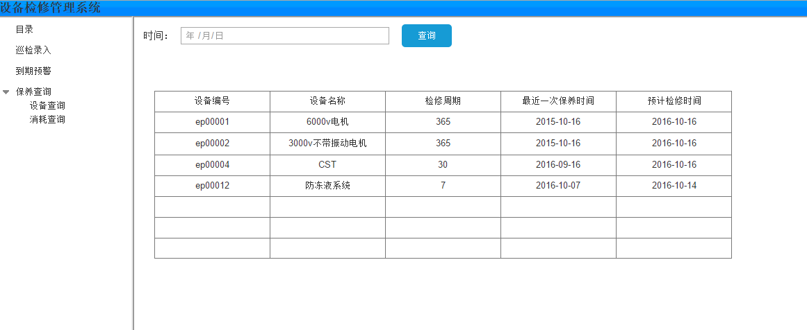

#设备检修系统
###1、原型设计说明  
首页：  
  
目录：  
  
点击查看，可以查看设备的保养报告（只设置了一个，蓝色的）  
巡检录入：  
  
输入编号（ep00004）之后点击确定，找到该设备，出现设备名称、设备类型、检修类型  
  
点击是否正常，如果点击是，出现确定，直接点击即可，如果点否，出现详细保养项目  
  
点击添加，弹出耗材输入框  
  
到期预警:  
输入时间，点击查询  
  
设备查询:  
输入设备号，查看保养情况  
  
点击不正常进行查看,查看详细情况  
  
点击生成检修报告按钮生成检修报告 
  
###2、概念模型ER图  
  
###3、数据库模型图  
  
###4、sql建表语句  
-- MySQL Script generated by MySQL Workbench
-- 10/13/16 20:42:05
-- Model: New Model    Version: 1.0
-- MySQL Workbench Forward Engineering

SET @OLD_UNIQUE_CHECKS=@@UNIQUE_CHECKS, UNIQUE_CHECKS=0;
SET @OLD_FOREIGN_KEY_CHECKS=@@FOREIGN_KEY_CHECKS, FOREIGN_KEY_CHECKS=0;
SET @OLD_SQL_MODE=@@SQL_MODE, SQL_MODE='TRADITIONAL,ALLOW_INVALID_DATES';

-- -----------------------------------------------------
-- Schema mydb
-- -----------------------------------------------------

-- -----------------------------------------------------
-- Schema mydb
-- -----------------------------------------------------
CREATE SCHEMA IF NOT EXISTS `mydb` DEFAULT CHARACTER SET utf8 ;
USE `mydb` ;

-- -----------------------------------------------------
-- Table `mydb`.`equipmenttype`
-- -----------------------------------------------------
CREATE TABLE IF NOT EXISTS `mydb`.`equipmenttype` (
  `etid` CHAR(10) NOT NULL,
  `etName` VARCHAR(100) NOT NULL,
  PRIMARY KEY (`etid`))
ENGINE = InnoDB;

-- -----------------------------------------------------
-- Table `mydb`.`overhualtype`
-- -----------------------------------------------------
CREATE TABLE IF NOT EXISTS `mydb`.`overhualtype` (
  `otid` CHAR(10) NOT NULL,
  `otName` VARCHAR(45) NOT NULL,
  `otPeriod` INT(10) NOT NULL,
  PRIMARY KEY (`otid`))
ENGINE = InnoDB;

-- -----------------------------------------------------
-- Table `mydb`.`equipment`
-- -----------------------------------------------------
CREATE TABLE IF NOT EXISTS `mydb`.`equipment` (
  `epid` CHAR(10) NOT NULL,
  `epName` VARCHAR(100) NOT NULL,
  `etid` CHAR(10) NOT NULL,
  `otid` CHAR(10) NOT NULL,
  PRIMARY KEY (`epid`),
  INDEX `fk_equipment_equipmenttype_idx` (`etid` ASC),
  INDEX `fk_equipment_overhualtype1_idx` (`otid` ASC),
  CONSTRAINT `fk_equipment_equipmenttype`
    FOREIGN KEY (`etid`)
    REFERENCES `mydb`.`equipmenttype` (`etid`)
    ON DELETE NO ACTION
    ON UPDATE NO ACTION,
  CONSTRAINT `fk_equipment_overhualtype1`
    FOREIGN KEY (`otid`)
    REFERENCES `mydb`.`overhualtype` (`otid`)
    ON DELETE NO ACTION
    ON UPDATE NO ACTION)
ENGINE = InnoDB;

-- -----------------------------------------------------
-- Table `mydb`.`earlywarning`
-- -----------------------------------------------------
CREATE TABLE IF NOT EXISTS `mydb`.`earlywarning` (
  `ewid` CHAR(10) NOT NULL,
  `ewRecently` DATE NOT NULL,
  `ewProspective` INT(10) NOT NULL,
  `ewPeriod` INT(10) NOT NULL,
  `epid` CHAR(10) NOT NULL,
  PRIMARY KEY (`ewid`),
  INDEX `fk_earlywarning_equipment1_idx` (`epid` ASC),
  CONSTRAINT `fk_earlywarning_equipment1`
    FOREIGN KEY (`epid`)
    REFERENCES `mydb`.`equipment` (`epid`)
    ON DELETE NO ACTION
    ON UPDATE NO ACTION)
ENGINE = InnoDB;

-- -----------------------------------------------------
-- Table `mydb`.`maintainproject`
-- -----------------------------------------------------
CREATE TABLE IF NOT EXISTS `mydb`.`maintainproject` (
  `mpid` CHAR(10) NOT NULL,
  `mpName` VARCHAR(45) NOT NULL,
  `etid` CHAR(10) NOT NULL,
  PRIMARY KEY (`mpid`),
  INDEX `fk_maintainproject_equipmenttype1_idx` (`etid` ASC),
  CONSTRAINT `fk_maintainproject_equipmenttype1`
    FOREIGN KEY (`etid`)
    REFERENCES `mydb`.`equipmenttype` (`etid`)
    ON DELETE NO ACTION
    ON UPDATE NO ACTION)
ENGINE = InnoDB;

-- -----------------------------------------------------
-- Table `mydb`.`maintainrecord`
-- -----------------------------------------------------
CREATE TABLE IF NOT EXISTS `mydb`.`maintainrecord` (
  `mrid` CHAR(10) NOT NULL,
  `mrEmployee` VARCHAR(45) NOT NULL,
  `mrTime` DATE NOT NULL,
  `mrIsnormal` TINYINT(1) NOT NULL,
  `epid` CHAR(10) NOT NULL,
  PRIMARY KEY (`mrid`),
  INDEX `fk_maintainrecord_equipment1_idx` (`epid` ASC),
  CONSTRAINT `fk_maintainrecord_equipment1`
    FOREIGN KEY (`epid`)
    REFERENCES `mydb`.`equipment` (`epid`)
    ON DELETE NO ACTION
    ON UPDATE NO ACTION)
ENGINE = InnoDB;

-- -----------------------------------------------------
-- Table `mydb`.`maintaindetails`
-- -----------------------------------------------------
CREATE TABLE IF NOT EXISTS `mydb`.`maintaindetails` (
  `mdid` CHAR(10) NOT NULL,
  `mdContents` VARCHAR(500) NULL,
  `mpid` CHAR(10) NOT NULL,
  `mrid` CHAR(10) NOT NULL,
  PRIMARY KEY (`mdid`),
  INDEX `fk_maintaindetails_maintainproject1_idx` (`mpid` ASC),
  INDEX `fk_maintaindetails_maintainrecord1_idx` (`mrid` ASC),
  CONSTRAINT `fk_maintaindetails_maintainproject1`
    FOREIGN KEY (`mpid`)
    REFERENCES `mydb`.`maintainproject` (`mpid`)
    ON DELETE NO ACTION
    ON UPDATE NO ACTION,
  CONSTRAINT `fk_maintaindetails_maintainrecord1`
    FOREIGN KEY (`mrid`)
    REFERENCES `mydb`.`maintainrecord` (`mrid`)
    ON DELETE NO ACTION
    ON UPDATE NO ACTION)
ENGINE = InnoDB;

-- -----------------------------------------------------
-- Table `mydb`.`maintainconsume`
-- -----------------------------------------------------
CREATE TABLE IF NOT EXISTS `mydb`.`maintainconsume` (
  `mcid` CHAR(10) NOT NULL,
  `mcMaterial` VARCHAR(100) NOT NULL,
  `mcNumber` INT(10) NOT NULL,
  `mrid` CHAR(10) NOT NULL,
  PRIMARY KEY (`mcid`),
  INDEX `fk_maintainconsume_maintainrecord1_idx` (`mrid` ASC),
  CONSTRAINT `fk_maintainconsume_maintainrecord1`
    FOREIGN KEY (`mrid`)
    REFERENCES `mydb`.`maintainrecord` (`mrid`)
    ON DELETE NO ACTION
    ON UPDATE NO ACTION)
ENGINE = InnoDB;

SET SQL_MODE=@OLD_SQL_MODE;
SET FOREIGN_KEY_CHECKS=@OLD_FOREIGN_KEY_CHECKS;
SET UNIQUE_CHECKS=@OLD_UNIQUE_CHECKS;
###5.查询语句  
保养查询：
SELECT epid 设备编号,mrEmployee 保养人员,mrTime 保养时间,mpName 项目名称,mdContents 保养内容,mcMaterial 消耗材料,mcNumber 材料数量 FROM maintainrecord,maintainconsume,maintaindetails,maintainproject WHERE maintainrecord.mrid=maintainconsume.mrid and maintainrecord.mrid=maintaindetails.mrid and maintainproject.mpid=maintaindetails.mpid;  
  
到期预警查询：
select equipment.epid 设备编号,equipment.epName 设备名称,earlywarning.ewProspective 预警提前期,earlywarning.ewPeriod 预警周期 from equipment,earlywarning where equipment.epid=earlywarning.epid and datediff(curdate(), earlywarning.ewRecently)>=(earlywarning.ewPeriod-earlywarning.ewProspective);  

